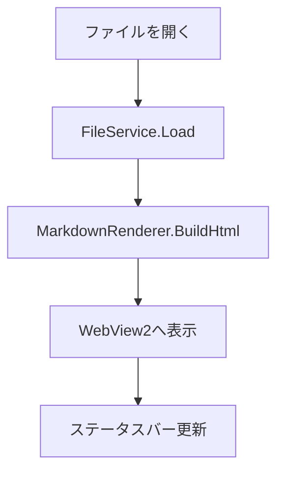

# MDV 検証用サンプル

> 作成日: 2026-07-01
> 目的: Task 9（ファイルを開いて描画する中核フロー）の手動検証用。
> 表・コードブロック・タスクリスト・インライン数式・Mermaid図・外部リンクを含む。

## 表

| 機能 | 状態 | 担当 |
| --- | --- | --- |
| ファイルオープン | 実装中 | Core |
| エンコード判定 | 完了 | Core |
| 描画 | 実装中 | App |

## コードブロック

```csharp
// 役割: サンプルのC#コードブロック表示確認用
public static int Add(int a, int b)
{
    return a + b;
}
```

## タスクリスト

- [x] WebView2の初期化
- [x] ファイルピッカーの実装
- [ ] テーマ切替の実装
- [ ] ズーム機能の実装

## インライン数式

質量とエネルギーの等価性は $E=mc^2$ で表される。

## Mermaid図



## 外部リンク

詳細は [Markdig](https://github.com/xoofx/markdig) のドキュメントを参照。
